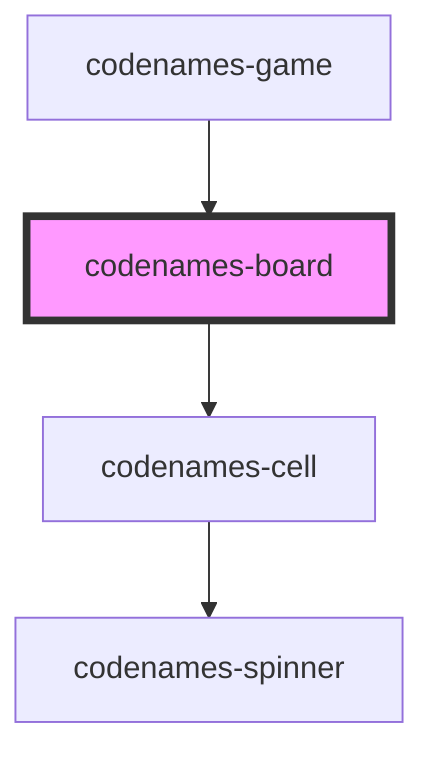

# codenames-board

<!-- Auto Generated Below -->

## Properties

| Property            | Attribute             | Description                                       | Type         | Default     |
| ------------------- | --------------------- | ------------------------------------------------- | ------------ | ----------- |
| `boardData`         | --                    | Board data used to generate the cells.            | `CellData[]` | `undefined` |
| `canGuess`          | `can-guess`           | Whether it is currently the user's turn to guess. | `boolean`    | `false`     |
| `loadingCellIndex`  | `loading-cell-index`  | Index of the cell currently loading.              | `number`     | `-1`        |
| `server`            | --                    | Library of server utilities.                      | `Server`     | `undefined` |
| `socketIsConnected` | `socket-is-connected` | Whether the socket is connected.                  | `boolean`    | `false`     |

## Dependencies

### Used by

 - [codenames-game](../codenames-game)

### Depends on

- [codenames-cell](../codenames-cell)

### Graph

----------------------------------------------

*Built with [StencilJS](https://stenciljs.com/)*
