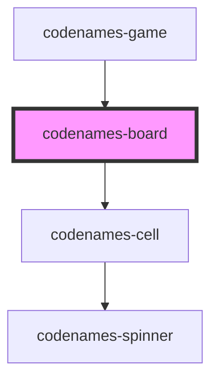

# codenames-board

<!-- Auto Generated Below -->

## Properties

| Property    | Attribute | Description                                        | Type         | Default     |
| ----------- | --------- | -------------------------------------------------- | ------------ | ----------- |
| `boardData` | --        | Board data used to generate the cells.             | `CellData[]` | `undefined` |
| `requests`  | --        | Library of requests that can be made to the server | `Requests`   | `undefined` |

## Dependencies

### Used by

 - [codenames-game](../codenames-game)

### Depends on

- [codenames-cell](../codenames-cell)

### Graph

----------------------------------------------

*Built with [StencilJS](https://stenciljs.com/)*
