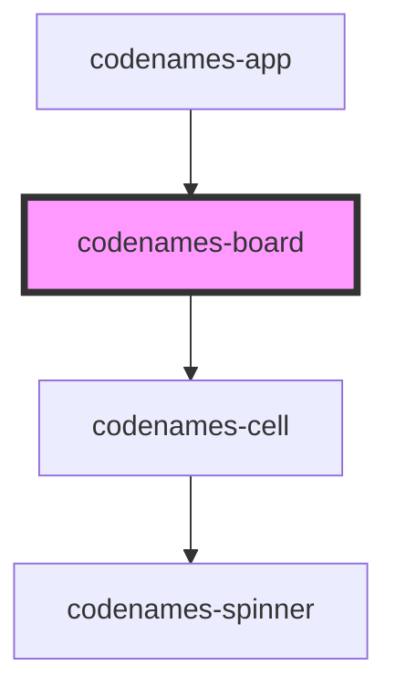

# codenames-board

<!-- Auto Generated Below -->

## Properties

| Property    | Attribute | Description                            | Type         | Default     |
| ----------- | --------- | -------------------------------------- | ------------ | ----------- |
| `boardData` | --        | Board data used to generate the cells. | `CellData[]` | `undefined` |

## Dependencies

### Used by

 - [codenames-app](../codenames-app)

### Depends on

- [codenames-cell](../codenames-cell)

### Graph

----------------------------------------------

*Built with [StencilJS](https://stenciljs.com/)*
