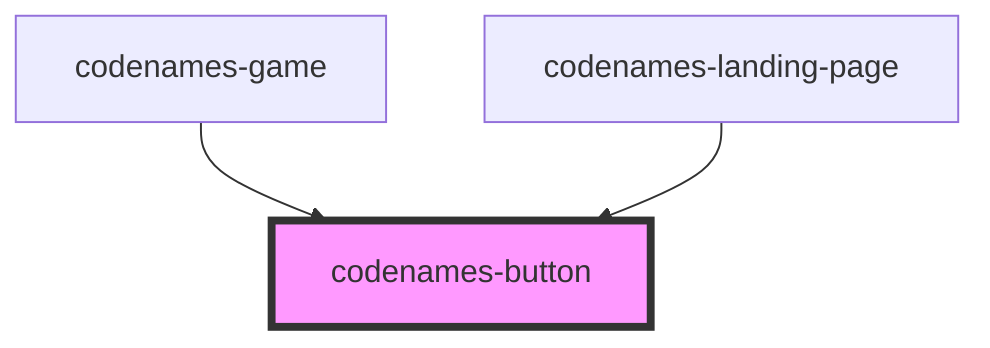

# codenames-button

<!-- Auto Generated Below -->

## Properties

| Property      | Attribute      | Description                                | Type                                                   | Default     |
| ------------- | -------------- | ------------------------------------------ | ------------------------------------------------------ | ----------- |
| `color`       | `color`        | Button color.                              | `Color.Black \| Color.Blue \| Color.Gray \| Color.Red` | `undefined` |
| `hoverCursor` | `hover-cursor` | Whether the cursor should change on hover. | `boolean`                                              | `undefined` |
| `on`          | `on`           | Whether button is on.                      | `boolean`                                              | `undefined` |

## Dependencies

### Used by

 - [codenames-game](../codenames-game)
 - [codenames-landing-page](../codenames-landing-page)

### Graph

----------------------------------------------

*Built with [StencilJS](https://stenciljs.com/)*
