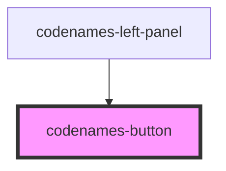

# codenames-button

<!-- Auto Generated Below -->

## Properties

| Property | Attribute | Description           | Type                                                   | Default     |
| -------- | --------- | --------------------- | ------------------------------------------------------ | ----------- |
| `color`  | `color`   | Button color.         | `Color.Black \| Color.Blue \| Color.Gray \| Color.Red` | `undefined` |
| `on`     | `on`      | Whether button is on. | `boolean`                                              | `undefined` |

## Dependencies

### Used by

 - [codenames-left-panel](../codenames-left-panel)

### Graph

----------------------------------------------

*Built with [StencilJS](https://stenciljs.com/)*
