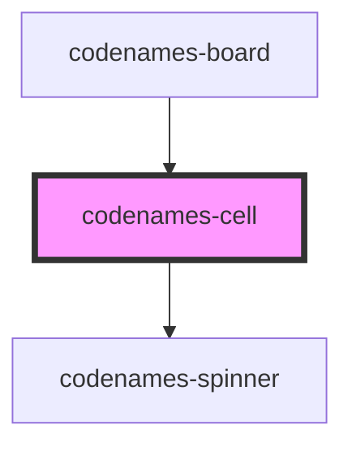

# my-component

<!-- Auto Generated Below -->

## Properties

| Property   | Attribute   | Description                                       | Type                                                   | Default       |
| ---------- | ----------- | ------------------------------------------------- | ------------------------------------------------------ | ------------- |
| `canGuess` | `can-guess` | Whether it is currently the user's turn to guess. | `boolean`                                              | `false`       |
| `color`    | `color`     | Cell color.                                       | `Color.Black \| Color.Blue \| Color.Gray \| Color.Red` | `Color.Gray`  |
| `index`    | `index`     | Index of the cell.                                | `number`                                               | `undefined`   |
| `loading`  | `loading`   | Whether cell is currently loading.                | `boolean`                                              | `false`       |
| `mode`     | `mode`      | Cell display mode.                                | `Mode.Endgame \| Mode.Normal \| Mode.Spymaster`        | `Mode.Normal` |
| `revealed` | `revealed`  | Whether the cell is revealed.                     | `boolean`                                              | `false`       |
| `server`   | --          | Library of server utilities.                      | `Server`                                               | `undefined`   |
| `word`     | `word`      | Word shown in cell.                               | `string`                                               | `""`          |

## Dependencies

### Used by

 - [codenames-board](../codenames-board)

### Depends on

- [codenames-spinner](../codenames-spinner)

### Graph

----------------------------------------------

*Built with [StencilJS](https://stenciljs.com/)*
