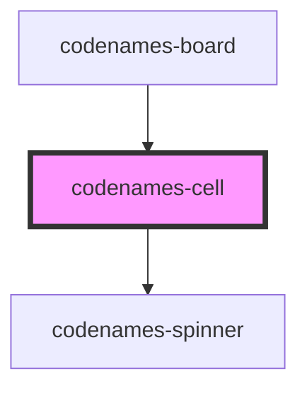

# my-component

<!-- Auto Generated Below -->

## Properties

| Property   | Attribute  | Description                                         | Type                                                   | Default       |
| ---------- | ---------- | --------------------------------------------------- | ------------------------------------------------------ | ------------- |
| `color`    | `color`    | Cell color.                                         | `Color.Black \| Color.Blue \| Color.Gray \| Color.Red` | `Color.Gray`  |
| `index`    | `index`    | Index of the cell.                                  | `number`                                               | `undefined`   |
| `mode`     | `mode`     | Cell display mode.                                  | `Mode.Endgame \| Mode.Normal \| Mode.Spymaster`        | `Mode.Normal` |
| `requests` | --         | Library of requests that can be made to the server. | `Requests`                                             | `undefined`   |
| `revealed` | `revealed` | Whether the cell is revealed.                       | `boolean`                                              | `false`       |
| `word`     | `word`     | Word shown in cell.                                 | `string`                                               | `""`          |

## Dependencies

### Used by

 - [codenames-board](../codenames-board)

### Depends on

- [codenames-spinner](../codenames-spinner)

### Graph

----------------------------------------------

*Built with [StencilJS](https://stenciljs.com/)*
