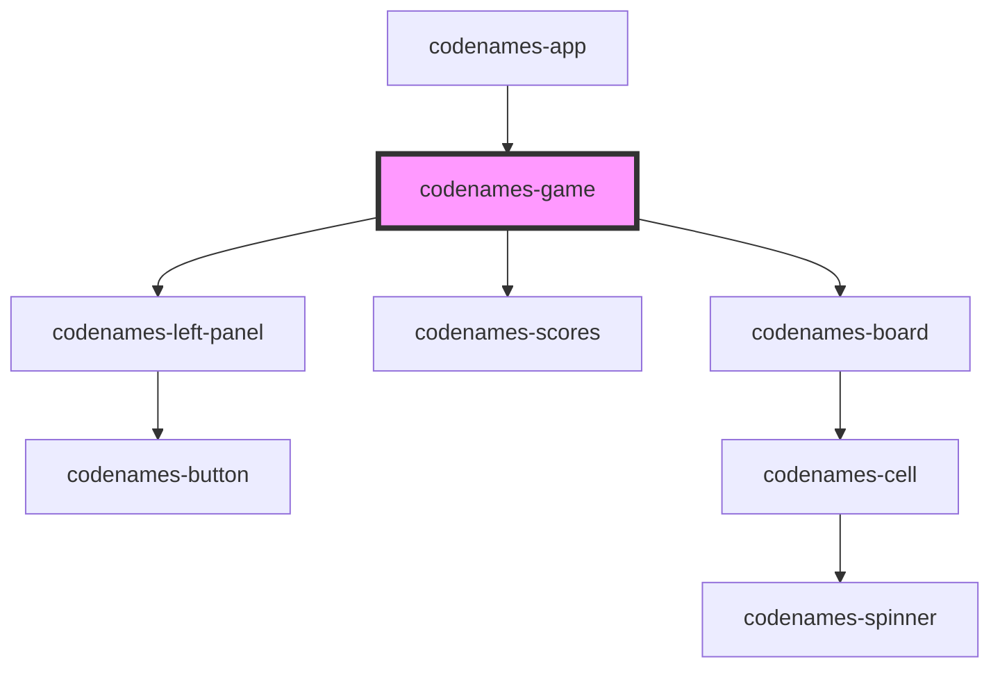

# codenames-game

<!-- Auto Generated Below -->

## Properties

| Property     | Attribute | Description                                            | Type         | Default     |
| ------------ | --------- | ------------------------------------------------------ | ------------ | ----------- |
| `gameData`   | --        | Game data used to populate values on the board and UI. | `GameData`   | `undefined` |
| `requests`   | --        | Library of requests that can be made to the server     | `Requests`   | `undefined` |
| `userPlayer` | --        | Player data for the user.                              | `PlayerData` | `undefined` |

## Dependencies

### Used by

 - [codenames-app](../codenames-app)

### Depends on

- [codenames-left-panel](../codenames-left-panel)
- [codenames-scores](../codenames-scores)
- [codenames-board](../codenames-board)

### Graph

----------------------------------------------

*Built with [StencilJS](https://stenciljs.com/)*
