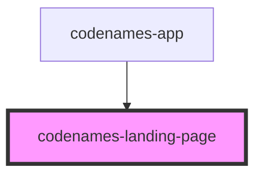

# codenames-landing-page

<!-- Auto Generated Below -->

## Properties

| Property   | Attribute  | Description                                         | Type       | Default     |
| ---------- | ---------- | --------------------------------------------------- | ---------- | ----------- |
| `requests` | --         | Library of requests that can be made to the server. | `Requests` | `undefined` |
| `username` | `username` | Username currently entered.                         | `string`   | `undefined` |

## Dependencies

### Used by

 - [codenames-app](../codenames-app)

### Graph

----------------------------------------------

*Built with [StencilJS](https://stenciljs.com/)*
