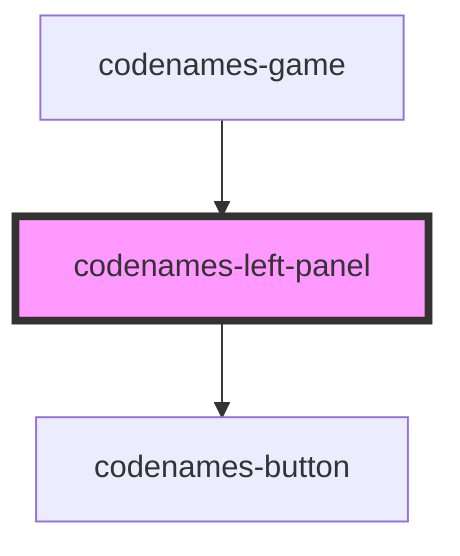

# codenames-left-panel

<!-- Auto Generated Below -->

## Properties

| Property     | Attribute | Description                                        | Type           | Default     |
| ------------ | --------- | -------------------------------------------------- | -------------- | ----------- |
| `players`    | --        | All players in the game.                           | `PlayerData[]` | `undefined` |
| `requests`   | --        | Library of requests that can be made to the server | `Requests`     | `undefined` |
| `userPlayer` | --        | Player data for the user.                          | `PlayerData`   | `undefined` |

## Dependencies

### Used by

 - [codenames-game](../codenames-game)

### Depends on

- [codenames-button](../codenames-button)

### Graph

----------------------------------------------

*Built with [StencilJS](https://stenciljs.com/)*
