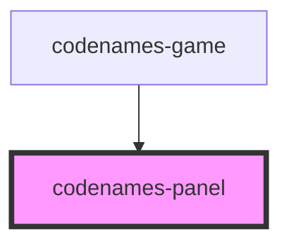

# codenames-panel

<!-- Auto Generated Below -->

## Properties

| Property            | Attribute             | Description                      | Type                                                   | Default     |
| ------------------- | --------------------- | -------------------------------- | ------------------------------------------------------ | ----------- |
| `panelTeam`         | `panel-team`          | Library of server utilities.     | `Color.Black \| Color.Blue \| Color.Gray \| Color.Red` | `undefined` |
| `players`           | --                    | All players in the game.         | `PlayerData[]`                                         | `undefined` |
| `server`            | --                    | Library of server utilities.     | `Server`                                               | `undefined` |
| `socketIsConnected` | `socket-is-connected` | Whether the socket is connected. | `boolean`                                              | `false`     |

## Dependencies

### Used by

 - [codenames-game](../codenames-game)

### Graph

----------------------------------------------

*Built with [StencilJS](https://stenciljs.com/)*
