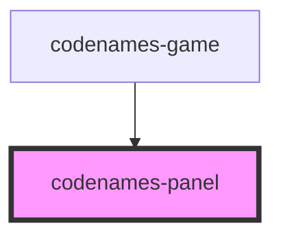

# codenames-panel

<!-- Auto Generated Below -->

## Properties

| Property    | Attribute    | Description                                         | Type                                                   | Default     |
| ----------- | ------------ | --------------------------------------------------- | ------------------------------------------------------ | ----------- |
| `panelTeam` | `panel-team` | Library of requests that can be made to the server. | `Color.Black \| Color.Blue \| Color.Gray \| Color.Red` | `undefined` |
| `players`   | --           | All players in the game.                            | `PlayerData[]`                                         | `undefined` |
| `requests`  | --           | Library of requests that can be made to the server. | `Requests`                                             | `undefined` |

## Dependencies

### Used by

 - [codenames-game](../codenames-game)

### Graph

----------------------------------------------

*Built with [StencilJS](https://stenciljs.com/)*
