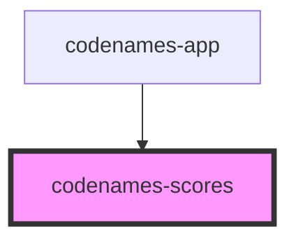

# codenames-scores

<!-- Auto Generated Below -->

## Properties

| Property | Attribute | Description        | Type                                                          | Default     |
| -------- | --------- | ------------------ | ------------------------------------------------------------- | ----------- |
| `scores` | --        | Scores to display. | `{ blue: number; red: number; gray: number; black: number; }` | `undefined` |

## Dependencies

### Used by

 - [codenames-app](../codenames-app)

### Graph

----------------------------------------------

*Built with [StencilJS](https://stenciljs.com/)*
