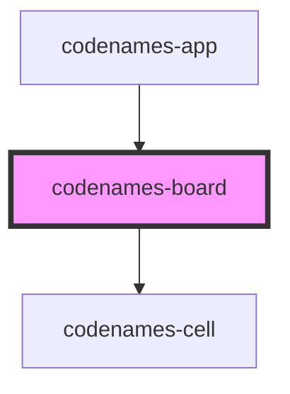

# codenames-board

<!-- Auto Generated Below -->

## Properties

| Property   | Attribute | Description                           | Type               | Default     |
| ---------- | --------- | ------------------------------------- | ------------------ | ----------- |
| `cellData` | --        | Cell data used to generate the cells. | `SingleCellData[]` | `undefined` |

## Dependencies

### Used by

 - [codenames-app](../codenames-app)

### Depends on

- [codenames-cell](../codenames-cell)

### Graph

----------------------------------------------

*Built with [StencilJS](https://stenciljs.com/)*
