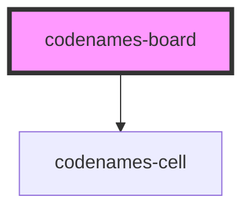

# codenames-board

<!-- Auto Generated Below -->

## Properties

| Property       | Attribute | Description                           | Type         | Default     |
| -------------- | --------- | ------------------------------------- | ------------ | ----------- |
| `cellDataList` | --        | Data list used to generate the cells. | `CellData[]` | `undefined` |

## Dependencies

### Depends on

- [codenames-cell](../codenames-cell)

### Graph

----------------------------------------------

*Built with [StencilJS](https://stenciljs.com/)*
