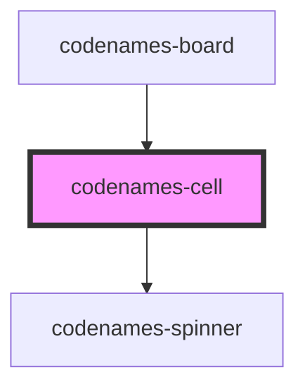

# my-component

<!-- Auto Generated Below -->

## Properties

| Property   | Attribute  | Description                   | Type                                                                   | Default           |
| ---------- | ---------- | ----------------------------- | ---------------------------------------------------------------------- | ----------------- |
| `color`    | `color`    | Cell color.                   | `CellColor.Black \| CellColor.Blue \| CellColor.Gray \| CellColor.Red` | `CellColor.Gray`  |
| `mode`     | `mode`     | Cell display mode.            | `CellMode.Endgame \| CellMode.Normal \| CellMode.Spymaster`            | `CellMode.Normal` |
| `revealed` | `revealed` | Whether the cell is revealed. | `boolean`                                                              | `false`           |
| `word`     | `word`     | Word shown in cell.           | `string`                                                               | `""`              |

## Dependencies

### Used by

 - [codenames-board](../codenames-board)

### Depends on

- [codenames-spinner](../codenames-spinner)

### Graph

----------------------------------------------

*Built with [StencilJS](https://stenciljs.com/)*
